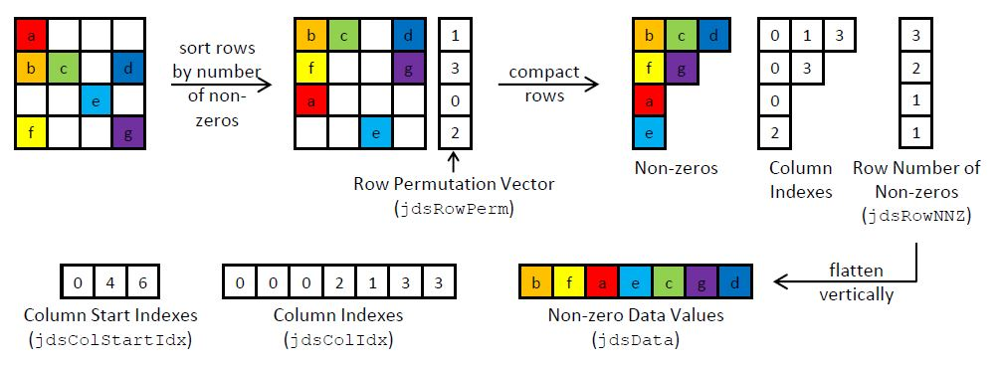
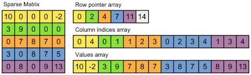

# cuda-sparse-matrix-vector-multiplication

## Overview

This is an implementation of a parallel sparse-matrix vector multiplication algorithm on the GPU. This provides an
understanding of the different sparse matrix storage formats and their impacts on performance. The formats used in this
implementation are Compressed Sparse Row (CSR) and Jagged Diagonal Storage (JDS).

The following figure illustrates the components of a JDS matrix and how it is logically constructed.

The following figure illustrates the components of a CSR matrix and how it is logically constructed.

## Execution

* Run "make" to build the executable of this file.
* For debugging, run "make dbg=1" to build a debuggable version of the executable binary.
* Run the binary using "./~name-of-the-artifact~"

There are two modes of operation for the application -

* Mode 1 executes the CSR kernel.
* Mode 2 executes the JDS kernel.
